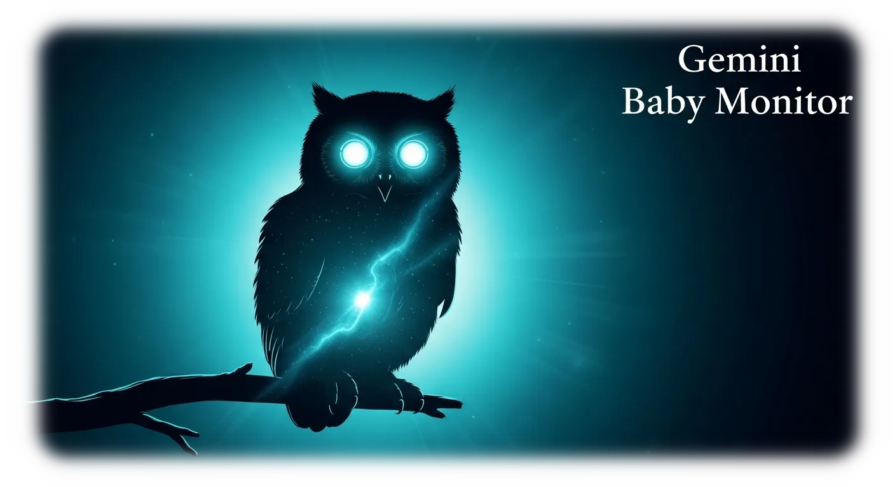
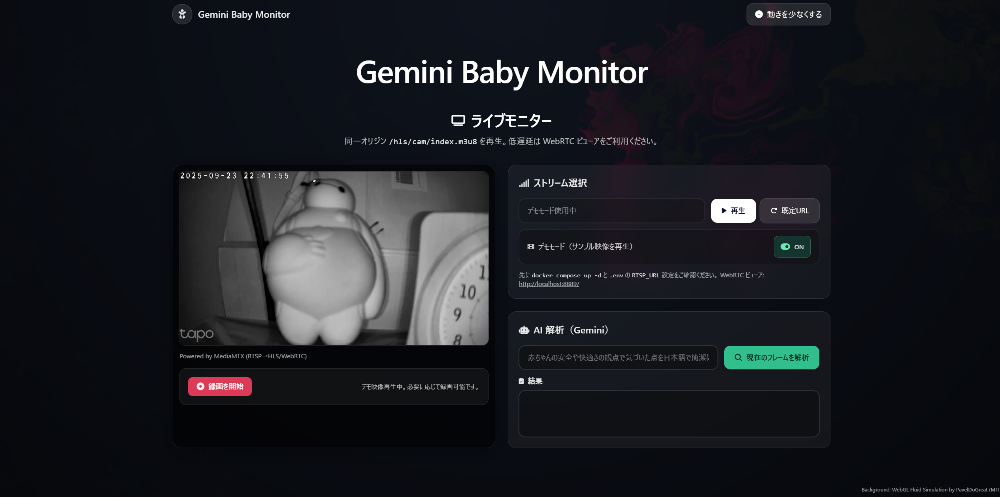

<div align="center">

  <p>
    
  </p>

  <p>
    <a href="https://developer.mozilla.org/docs/Web/HTML">
      
    </a>
    <a href="https://developer.mozilla.org/docs/Web/CSS">
      
    </a>
    <a href="https://tailwindcss.com/">
      
    </a>
    <a href="https://fastapi.tiangolo.com/">
      
    </a>
    <a href="https://www.docker.com/">
      
    </a>
  </p>

  <h1>👶 Gemini Baby Monitor Web App</h1>

  <p>
    ネットワークカメラの映像をブラウザで見守り、Gemini API で安全チェックをサポートする軽量 Web アプリです。
  </p>
</div>

---


## 📘 概要
- ブラウザで HLS / WebRTC 再生に対応したベビーモニター UI
- RTSP カメラを MediaMTX で HLS/WebRTC に変換する Docker Compose 構成を提供
- Gemini API を使った画像解析ゲートウェイで安全チェックを自動化
- 純 HTML 版 (`index.html`) と Docker Compose 版 (`app/`) の 2 通りで利用可能

## 🚀 クイックスタート
### 1. シンプル Web 版 (HTML/CSS/JS のみ)
1. リポジトリをクローン
   ```bash
   git clone https://github.com/Sunwood-ai-labsII/baby-monitor-web-app.git
   cd baby-monitor-web-app
   ```
2. `index.html` をブラウザで開く
3. ネットワークカメラの MJPEG/HLS URL を入力して再生

### 2. Docker Compose 版 (HLS/WebRTC + AI 解析)
1. 必要条件: Docker, Docker Compose, Google Gemini API キー
2. `.env` を準備（テンプレからコピー）
   ```bash
   cd app
   cp .env.example .env
   # RTSP_URL と GEMINI_API_KEY を実環境に合わせて編集
   ```
3. コンテナを起動
   ```bash
   docker compose up -d
   ```
4. ブラウザで確認
   - HLS プレイヤー: http://localhost:8080/
   - WebRTC ビューア: http://localhost:8889/
 - Gemini 解析 API ヘルスチェック: http://localhost:8081/healthz

> 💡 Tapo シリーズなどの RTSP URL 例: `rtsp://<USER>:<PASS>@<CAM_IP>:554/stream1`

## 🏗️ アーキテクチャ
以下の図は Docker Compose 版を中心とした全体像です。MediaMTX が RTSP ストリームを HLS/WebRTC に変換し、Web UI と Gateway が連携して Gemini API に安全チェックを依頼します。

```mermaid
graph LR
  subgraph Client
    U[ユーザー]
    B[ブラウザ Web UI]
  end

  subgraph Docker Compose スタック
    C[(RTSP カメラ)]
    M[MediaMTX\n(HLS & WebRTC)]
    W[静的 Web サーバー\n(app/web)]
    G[Gateway API\n(FastAPI + Gemini SDK)]
  end

  A[(Google Gemini API)]

  U --> B
  W -->|UI 配信| B
  C -->|RTSP| M
  M -->|HLS/WebRTC| B
  B -->|スナップショット要求| G
  G -->|画像解析リクエスト| A
  A -->|安全コメント| G
  G -->|解析結果| B
  M -.->|スナップショット| G
```

## 🖥️ 使い方
- HLS プレイヤーの URL 入力欄に `http://localhost:8888/cam/index.m3u8` を設定すると Docker 版のストリームを視聴できます。
- 「現在のフレームを解析」ボタンで Gateway にスナップショットが送信され、Gemini からのコメントが表示されます。
- MJPEG などブラウザで直接再生できる場合は、シンプル版でも URL 入力だけで利用可能です。

## 🧪 デモ & スクリーンショット
<div align="center">
  <p>
    
  </p>
</div>

- `app/demo/` には収録済みのデモ WebM が含まれています。
- 詳細な UI は `app/web/index.html` を参照してください。

## 📂 プロジェクト構成
```text
.
├── index.html               # 単体で動くシンプルプレーヤー
├── app/                     # Docker Compose 構成 (MediaMTX + Gateway + Web)
├── example/                 # 応用サンプル (RTSP ビューア, Gemini リアルタイム解析 等)
├── docs/                    # アーキテクチャ図・イラスト
└── GEMINI.md                # ギャルエンジニア向けプロンプト
```

## 🔒 環境変数
- 機密情報はコミットせず `.env` で管理してください。
- 代表的な変数は以下の README を参照:
  - `app/.env.example`: MediaMTX + Gateway 用の RTSP_URL / GEMINI_API_KEY
  - `example/tapo-rtsp-viewer/.env.example`: Tapo RTSP ビューア用
  - `example/gemini-realtime-streaming/.env.example`: Gemini ストリーミング サンプル用

> `.gitignore` により `app/.env` と `example/**/.env` はバージョン管理から除外されています。

## 📚 関連ドキュメント
- `app/README.md`: Docker Compose 構成とサービスの詳細
- `example/README.md`: サンプルコード集の索引
- `example/tapo-rtsp-viewer/README.md`: Tapo カメラ設定と Python ビューア
- `example/gemini-realtime-streaming/README.md`: Gemini リアルタイム解析の使い方

必要に応じて各 README を参照し、重複を避けながら情報を補完しています。

## 🤝 コントリビュート
改善提案やプルリクエストは大歓迎です。Issue を立ててからの提案もスムーズです。

## 📄 ライセンス
このプロジェクトは [MIT License](LICENSE) のもとで公開されています。
